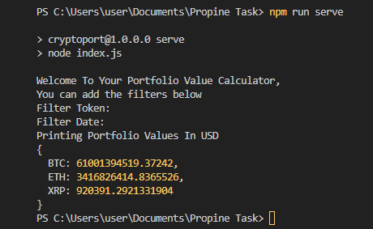
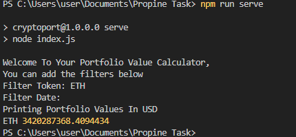
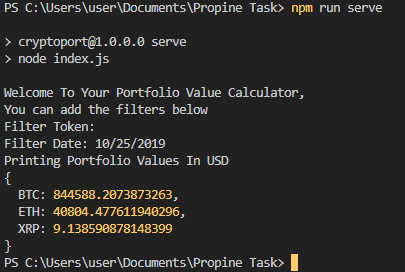
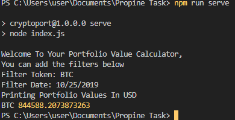

# CRYPTO TOKEN PORTFOLIO VALUE CALCULATOR
## Propine Programming Question
I wrote this program in typescript and had some scripts to compile and build it into a Javascript file that I run.

I also tried to write in a maintanable and to be able to scale regardless of which crypto token is used or added.
### 1. Import Dependencies
I imported all modules that I'm going to use
```
const fs = require('node:fs');
const csv = require('fast-csv')
const readlineSync = require('readline-sync');
import axios, {AxiosResponse} from 'axios';
```
* `fs` is node.js module for manipulating files, It will be used for opening the CSV file.

* `csv` is an installed module that provides an API for manipulating csv files.

* `readlineSync` is a command line module that I'll use to Get user Input of filter parameters interactively.

* `axios` is a module that is used for querying APIS, I'll use it to fetch exchange rates from cryptocompare'S API

### 2. Define Constant/Global Variables
```
const CSVPath = "C://transactions.csv";
let apiUrl = 'https://min-api.cryptocompare.com/data/price'
let exchangeCurrency = 'USD'
let tokens = {
/*
    ETH: 200,
    BTH: 10
*/
    }
}
```


### 2. Define Typescript Types
```
type tokenType = {
    timestamp: string,
    transaction_type: string,
    token: string,
    amount: string
}

type optionsType  = {
    inputToken?: string,
    inputDate?: string
}
```
`tokenType` represents tokens that are read from the csv file.

`optionsType` represents parameters that will be passed to the processing function

### 3. Get User Input and Initialize App.
```
const InitializeApp = () => {
    console.log('Welcome To Your Portfolio Value Calculator,\nYou can add the filters below')
    let inputToken = readlineSync.question('Filter Token: ').toUpperCase()
    let inputDate = readlineSync.question('Filter Date: ')

    ProcessCSV({inputToken, inputDate})
}
```
Here I take non mandatory token and date filters from the user.
I then call `ProcessCSV`.

### 4. Process the CSV file.
```
const ProcessCSV = (options:optionsType) => {
    const stream = fs.createReadStream(CSVPath);
    
    stream.pipe(csv.parse({headers: true}))
    .on('error', (error:Error) => console.error(error))
    .on('data', (token:tokenType) => {
        if (tokens[token.token] === undefined)
            tokens[token.token] = 0;

        if(options.inputDate !== undefined && options.inputDate !== ''){
            const transDate = new Date(parseInt(token['timestamp'])*1000).toLocaleDateString()
            const inputDate = new Date(options.inputDate).toLocaleDateString()
            if(transDate === inputDate)
                CalculateValue(token)
        } else
            CalculateValue(token)
    })
    .on('end', () => {        
        SetAmountToExchanged(options)
    })
}
```
In the above function, I first define `stream` variable that uses `fs.createReadStream` module with the CSV File path argument.
I then use `pipe` with `csv.parse` which returns a promise that allows me to read each line of the csv file.
I then pass a callback function to `on('data')` Event to get each line of data.

I then insert the token to `tokens` global variable as a `key` and `0` as value.

I then check whether `inputDate` parameter is blank or undefined

* if TRUE, I filter out the records whose transaction date(`transDate`) is not equal to the `inputDate` and call `CalculateDebitCreditValue` with `token` as parameter for matching transaction date record.

* If FALSE, then I just directly call `CalculateDebitCreditValue` with the `token` as parameter whose purpose is explained below.

### 5. Calculate Debit Credit from the amount
```
const CalculateDebitCreditValue = (token:tokenType) => {
    if(token['transaction_type'] === 'DEPOSIT')
        tokens[token.token] += parseFloat(token.amount)
    else
        tokens[token.token] -+ parseFloat(token.amount)
}
```
`CalculateDebitCreditValue` function which takes `token` as parameter, adds or substracts the amount to `tokens` `value` depending on the transaction type.

### 6. Convert Tokens Values to USD

I Use `exchangeCurrency = 'USD'` defined earlier.
This can be changed to any other currency, it can even be fetched from an API or from and environment variable.

The below function will fetch `exchange rates` of all tokens in our `tokens` object and use the result for conversion.
```
const SetAmountToExchanged = (options:optionsType) => {
    let tokenKeys = ''
    
    Object.entries(tokens).forEach(([key]) => {
        tokenKeys += ','+key
    })        

    axios.get(apiUrl, {
        params:{
            fsym:exchangeCurrency,
            tsyms: tokenKeys
        }
    }).then(({data}:AxiosResponse) => {

        Object.entries(tokens).forEach(([key]) => {            
            if(key in data)
                tokens[key] = tokens[key] / data[key]
        })

        PrintPortfolioValues(options)

    }).catch((error:Error) =>{
        console.error(error)
    })
}
```
We first create a string of our token keys joined with a comma `,` as shown below.
```
let tokenKeys = ''    
Object.entries(tokens).forEach(([key]) => {
    tokenKeys += ','+key
})        
```
`tokenKeys` is then passed as a parameter to axios as `tsyms` and `exchangeCurrency` as `fsym`.

The resulting Example URL Would then be
```
https://min-api.cryptocompare.com/data/price?fsym=USD&tsyms=BTC,ETH,XTC
```
The API response would be an object with the crypto tokens as the keys.
I then just map the `tokens` object and convert their values with the `exchange rate` received.

After that I call `PrintPortfolioValues` Function thats responsible for printing all results.
```
Object.entries(tokens).forEach(([key]) => {            
    if(key in data)
        tokens[key] = tokens[key] / data[key]
    })

PrintPortfolioValues(options)
```

### 7. Print the Result.
```
const PrintPortfolioValues = (options:optionsType) => {
    console.log(`Printing Portfolio Values In ${exchangeCurrency}`)
    if(options.inputToken !== undefined && options.inputToken !== '')
        console.log(options.inputToken, tokens[options.inputToken])
    else
        console.log(tokens)
}
```
This function will check if there is an `inputToken`.
* If theres an input token, then it will filter the results to only those of that token.
* If theres is none, then it will print all the tokens with their values.

## Results
### 1. Without any parameter

### 2. With token only as a parameter
FILTER `token = ETH`


### 3. With date only as a parameter
FILTER `date = 10/25/2019`


### 4. With token and date as parameters

FILTER `token = BTC, date = 10/25/2019`


